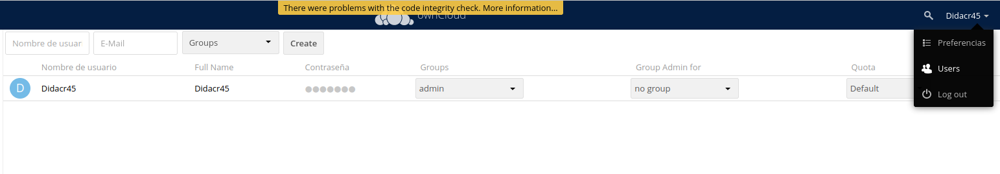
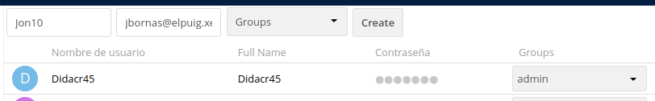
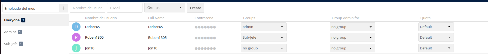
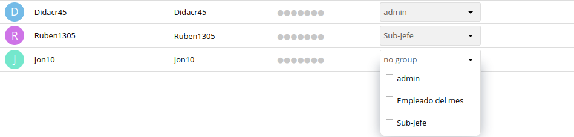
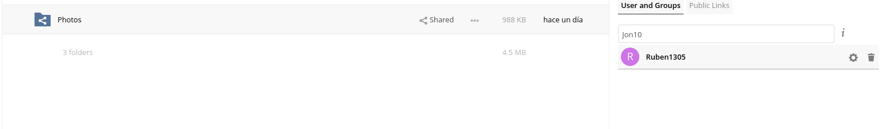
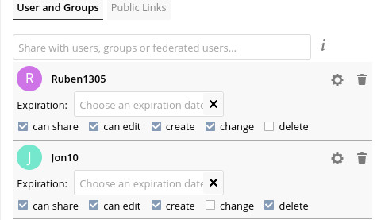
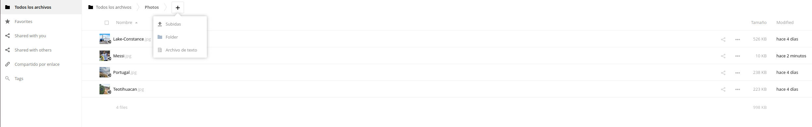

# Configuarion del OwnCloud

1. Lo primero que aremos sera entrar en el apartado de usuarios dandole clik a tu nombre de usuario

Para entrar al apartado que se muestra en la foto tendras que dare a tu nombre de usuario i luego darle al apatado **User**

2. Lo primero que aremos sera crear un usuaruio en el OwnCloud

En el primer apartado pondremos el **nombre de usuario**, en el segundo el **correo del nombre de usuario** y para finalizar le damos al **create** para finalizar con la cereacion del usuario

3. Tendremos que crear un grupo con el nombre que queramos para poder darle un rol a un usuario creado anteriormente

Para crear un grupo tendremos que darle a arriba a la izquierda que saldra **Add Group** y te saldra para escribir el nombre de rol que quieras darle, yo por ejemplo e puesto **Empleado del mes** pero tu puedes poner el que a ti mas te guste, luego daras al **+** i ya tendras el grupo creado.

4. Luego tendremos que darle un rol ya creado anteriormente a un usuario

Para dar un **Rol** ya creado tendras que darle al apartado **Roles** que sale en el usuario i añadir el que has creado anteriormente.

5. Para dar permisos a un usuario primero tendras que compartitle una carperta (La que a ti mas te guste)

Luego para ya darle permisos en esa capeta tendras que poner el raton sobre el usuario al cual le ayas compartido la capeta darle a la tuerca y podras ponerle permisos para editar, para ver o para borrar.

Una vez ya dado los permisos tedras que entrar a un usuario creado para poder meter archivos en la carpeta que ya le hayas compartido anteriormente 

Entraremos en la carpeta que hayamos compartido i subiremos un archivo cualquiera, para poder subir un archivo tendremos que dar al boton **+** y una vez ya dado le daremos al boton subidas y cojeremos el archivo que mas dese

#Pendiente de Explicar:

- Configuracion Trusted Domains -> MV en red Puig Castellar 1 (Acceso Desde cualquier equipo del instituto), Conseguir IP de algun compañero, modificar config.php para añadir las IPs (sudo nano /var/www/html/config/config.php), añadir IPs de compañeros en el trusted domains (https://doc.owncloud.com/server/next/admin_manual/maintenance/migrating.html), reiniciar el servicio (sudo systemctl restart apache2), dar tu ip a los compañeros añadidos al trusted dommains (ip a), probar a iniciar sesion

