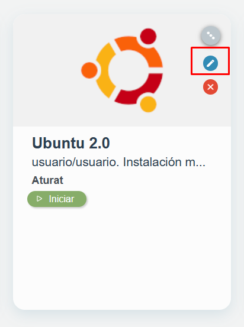
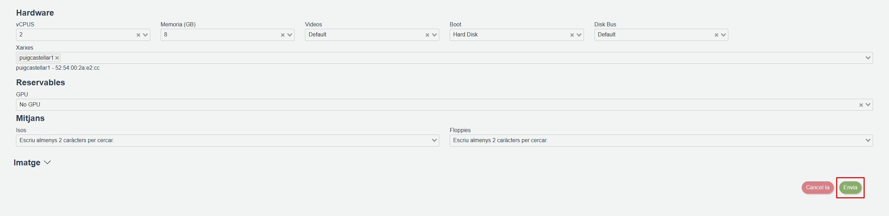
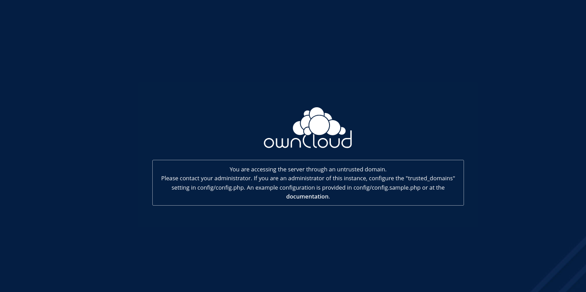
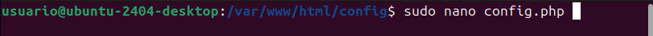
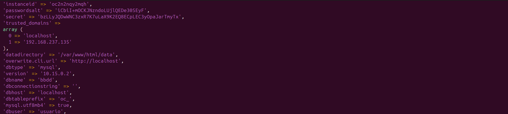

# Configuarion del OwnCloud

1. Lo primero que haremos será entrar en el apartado de usuarios dándole clic a tu nombre de usuario.

Para entrar al apartado que se muestra en la foto, tendrás que darle a tu nombre de usuario y luego darle al apartado. **User**

2. Lo primero que haremos será crear un usuario en el OwnCloud.

En el primer apartado pondremos el **nombre de usuario**, en el segundo el **correo del nombre de usuario** y para finalizar le damos al **create** para finalizar con la cereacion del usuario

3. Tendremos que crear un grupo con el nombre que queramos para poder darle un rol a un usuario creado anteriormente

Para crear un grupo tendremos que darle a arriba a la izquierda que saldra **Add Group** y te saldra para escribir el nombre de rol que quieras darle, yo por ejemplo e puesto **Empleado del mes** pero tu puedes poner el que a ti mas te guste, luego daras al **+** i ya tendras el grupo creado.

4. Luego tendremos que darle un rol ya creado anteriormente a un usuario

Para dar un **Rol** ya creado tendras que darle al apartado **Roles** que sale en el usuario i añadir el que has creado anteriormente.

5. Para dar permisos a un usuario primero tendras que compartitle una carperta (La que a ti mas te guste)

Luego para ya darle permisos en esa capeta tendras que poner el raton sobre el usuario al cual le ayas compartido la capeta darle a la tuerca y podras ponerle permisos para editar, para ver o para borrar.

Una vez ya dado los permisos tedras que entrar a un usuario creado para poder meter archivos en la carpeta que ya le hayas compartido anteriormente 

Entraremos en la carpeta que hayamos compartido i subiremos un archivo cualquiera, para poder subir un archivo tendremos que dar al boton **+** y una vez ya dado le daremos al boton subidas y cojeremos el archivo que mas dese

## Configuracion de Trusted Domain

Para poder conectar varias VM tendras que ir al isarvdi y poner la red de puigcastellar1

Para poder llegar a cambiar la red tendras que segir estos pasos:

Despues te saldra este error y para arregrarlo tendras que seguir los sigientes pasos

Para poder solucionarlo tendras que llegar al archivo de **config.php** tendras que hacer un /var/www/html/config para poder llegar al archivo.

Para poder entrar al archivo tendras que hacer el comando:

Y para que otros compañeros se puedan conectar a tu OwnCloud deveras poner tu IP en el apartado de **Trusted Domain** de el **config.php**

